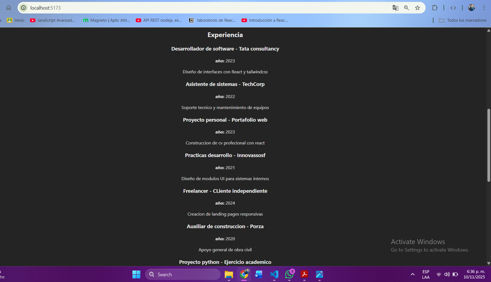
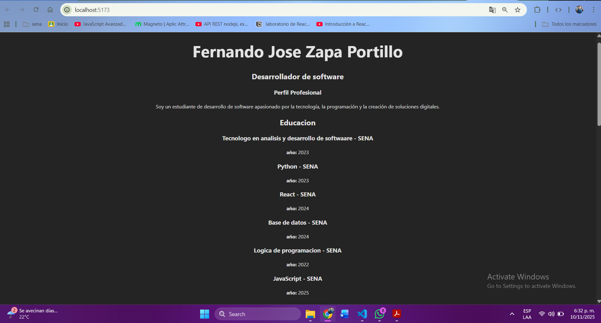
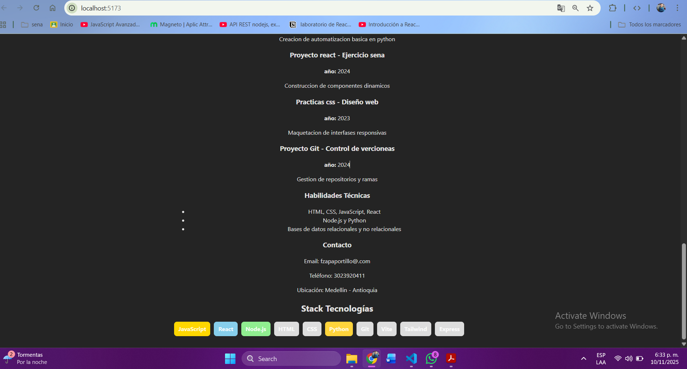

# CV React - Fernando Zapa

Proyecto desarrollado en React + Vite para construir un Currículum Vitae dinámico utilizando:

- Renderizado condicional
- Renderizado de listas con map()
- Componentes reutilizables
- Estilos dinámicos según tecnología

## Instrucciones para ejecutar el proyecto

1. Clonar el repositorio
2. Abrir la carpeta del proyecto
3. Instalar dependencias:

### Vista final del proyecto (Pantalla 1)

### Vista final del proyecto (Pantalla 2)

### Vista final del proyecto (Pantalla 3)

# React + Vite

This template provides a minimal setup to get React working in Vite with HMR and some ESLint rules.

Currently, two official plugins are available:

- [@vitejs/plugin-react](https://github.com/vitejs/vite-plugin-react/blob/main/packages/plugin-react) uses [Babel](https://babeljs.io/) (or [oxc](https://oxc.rs) when used in [rolldown-vite](https://vite.dev/guide/rolldown)) for Fast Refresh
- [@vitejs/plugin-react-swc](https://github.com/vitejs/vite-plugin-react/blob/main/packages/plugin-react-swc) uses [SWC](https://swc.rs/) for Fast Refresh

## React Compiler

The React Compiler is not enabled on this template because of its impact on dev & build performances. To add it, see [this documentation](https://react.dev/learn/react-compiler/installation).

## Expanding the ESLint configuration

If you are developing a production application, we recommend using TypeScript with type-aware lint rules enabled. Check out the [TS template](https://github.com/vitejs/vite/tree/main/packages/create-vite/template-react-ts) for information on how to integrate TypeScript and [`typescript-eslint`](https://typescript-eslint.io) in your project.
